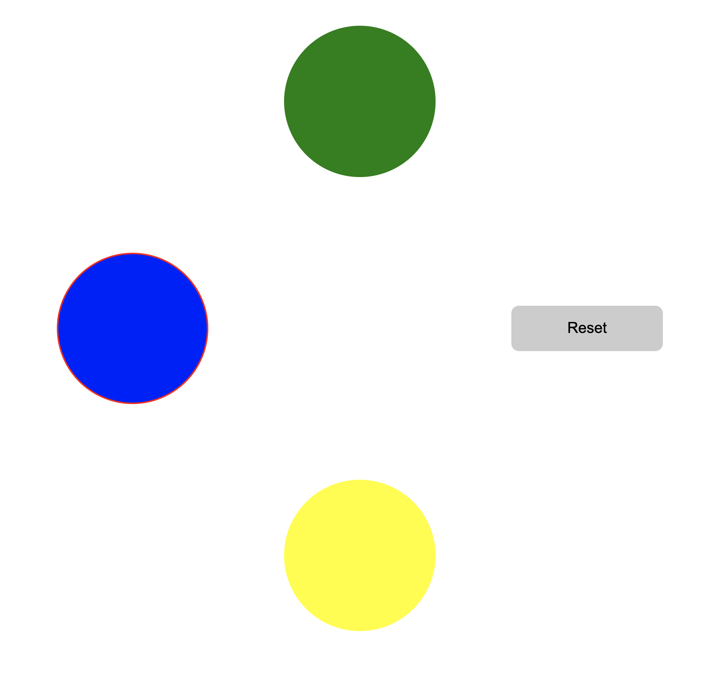

# Mini Game

## Description
The game have 4 buttons:
- A circle green button
- A circle blue button
- A circle yellow button
- A round button use to reset the game

At the start you will be at `blue button`, you can move to green or yellow with the rules:
- From Blue, you can go with Green
- From Blue, you can go with Yellow
- From Green, you can only go to Blue
- From Yellow, you can only go to Blue
- You cannot visit Yellow consecutively
- The currently selected button will be a highlight in Red.




## How to test the application

I use 2 variables to handle logic of the game. A variable used to identify currently selected button and check its possible moves. And the other one used to check if yellow button has been visited consecutively.

## Tech stack
- Server: ExpressJS
- Client: ReactJS, Redux, Redux-saga

## Requirements

- node v12+
- npm 6.x
- yarn 1.22.x

### Setup project
```bash
# Get source
git clone git@github.com:NguyenTrung1995/mini-game.git

# Install service
cd mini-game
yarn install
yarn install-server

# Start game
yarn start-dev

(You will start at local with 2 port: 4000(client) & 8001(server))
```
